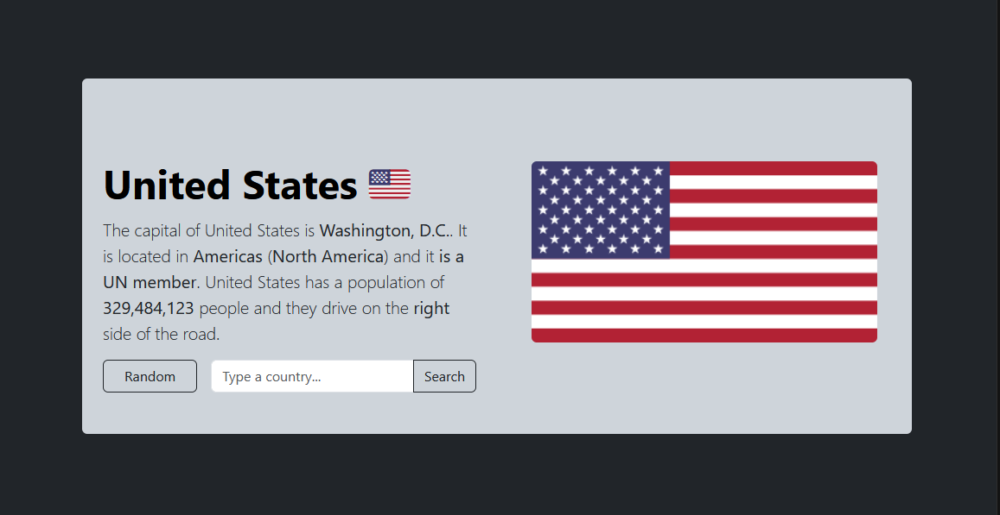

# Country Info

Find out what the capital of a country is, as well as other information, using the following program. You can search a country or select the random button to get a random country instead.  

  Try the program: 
  <a href="https://paper-clips.github.io/Country-Info/">link</a>

### Website Example

The program uses HTML, CSS, JavaScript, Bootstrap, and jQuery.
The Rest Countries API, which can be found [here](https://restcountries.com/), was used to get the information about each country.
